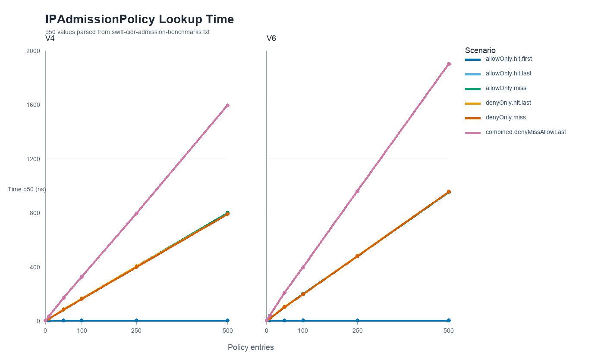

# CIDRAdmission Benchmarks

`CIDRAdmissionBenchmarkTarget` measures the current `IPAdmissionPolicy` array
implementation. The goal is to make admission-policy lookup cost visible before
adding a trie or another indexed lookup structure.

The benchmark package is intentionally separate from the public
`swift-cidr-admission` package so library users do not resolve benchmark-only
dependencies.

## Standard Commands

From the repository root:

```bash
./scripts/benchmarks.sh build
./scripts/benchmarks.sh list
./scripts/benchmarks.sh run
```

From the `Benchmarks/` package root:

```bash
swift build -c release --target CIDRAdmissionBenchmarkTarget
swift package benchmark list
swift package benchmark --target CIDRAdmissionBenchmarkTarget
```

## Benchmark Matrix

Lookup benchmarks cover IPv4 and IPv6 policies at these rule counts:

```text
0, 1, 10, 50, 100, 250, 500
```

The lookup scenarios show best and worst positions for the current linear array
scan:

- `policy.lookup.<family>.empty.defaultDeny`
- `policy.lookup.<family>.allowOnly.hit.first.<size>`
- `policy.lookup.<family>.allowOnly.hit.last.<size>`
- `policy.lookup.<family>.allowOnly.miss.<size>`
- `policy.lookup.<family>.denyOnly.hit.last.<size>`
- `policy.lookup.<family>.denyOnly.miss.<size>`
- `policy.lookup.<family>.combined.denyMissAllowLast.<size>`

Compile benchmarks measure configuration-to-policy construction:

- `policy.compile.<family>.allowOnly.<size>`
- `policy.compile.<family>.combined.<size>`

## Results

These results were measured on an Apple M1 Max running macOS 26.5.1 with Darwin
`25.5.0 Darwin Kernel Version 25.5.0: Mon Apr 27 20:38:56 PDT 2026; root:xnu-12377.121.6~2/RELEASE_ARM64_T6000 arm64`.



Lookup is exactly the expected linear array-scan shape, but the absolute cost is
very small. At 500 entries, worst-case one-list scans are about `795 ns` for
IPv4 and `955 ns` for IPv6. The combined deny-miss plus allow-last case is about
`1.6 us` for IPv4 and `1.9 us` for IPv6.

## Reading Results

`IPAdmissionPolicy` checks deny rules before allow rules. For an allow decision
with a non-empty deny list, the current implementation pays the deny-list scan
before it can find a matching allow rule.

Use targeted runs when evaluating whether a trie is justified:

```bash
./scripts/benchmarks.sh run --filter '^policy\.lookup\.v4\.combined\.denyMissAllowLast\.500$' --no-progress --time-units nanoseconds
./scripts/benchmarks.sh run --filter '^policy\.lookup\..*\.500$' --no-progress --time-units nanoseconds
```
