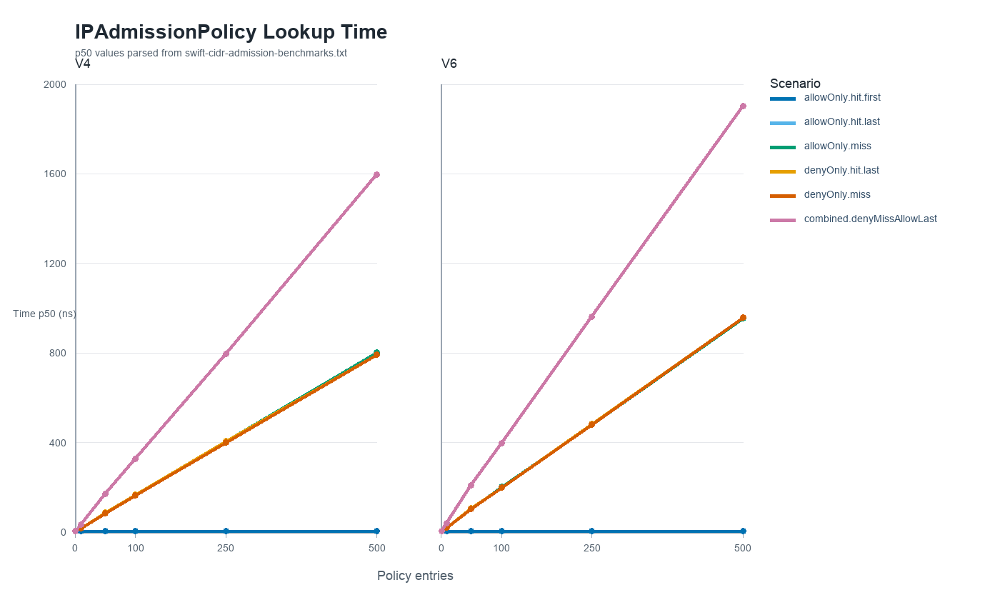

# CIDRAdmission Benchmarks

`CIDRAdmissionBenchmarkTarget` measures `IPAdmissionPolicy` construction and
the indexed Boolean `allows(_:)` path. The policy retains source rules for
`decision(for:)` diagnostics while compiling private, family-partitioned exact
coverage indexes for admission checks.

The benchmark package is intentionally separate from the public
`swift-cidr-admission` package so library users do not resolve benchmark-only
dependencies.

## Standard Commands

From the repository root:

```bash
./scripts/benchmarks.sh build
./scripts/benchmarks.sh list
./scripts/benchmarks.sh run
```

From the `Benchmarks/` package root:

```bash
swift build -c release --target CIDRAdmissionBenchmarkTarget
swift package benchmark list
swift package benchmark --target CIDRAdmissionBenchmarkTarget
```

## Benchmark Matrix

Lookup benchmarks cover IPv4 and IPv6 policies at these rule counts:

```text
0, 1, 10, 50, 100, 250, 500
```

The lookup scenario names retain their 0.1 source-fixture labels for historical
comparison. `first` and `last` now describe where the matching rule was placed
in the source configuration; they are not positions in a runtime linear scan:

- `policy.lookup.<family>.empty.defaultDeny`
- `policy.lookup.<family>.allowOnly.hit.first.<size>`
- `policy.lookup.<family>.allowOnly.hit.last.<size>`
- `policy.lookup.<family>.allowOnly.miss.<size>`
- `policy.lookup.<family>.denyOnly.hit.last.<size>`
- `policy.lookup.<family>.denyOnly.miss.<size>`
- `policy.lookup.<family>.combined.denyMissAllowLast.<size>`

Compile benchmarks measure configuration-to-policy construction:

- `policy.compile.<family>.allowOnly.<size>`
- `policy.compile.<family>.combined.<size>`

## Results

The checked-in chart is the **0.1 linear-array baseline**, measured on an Apple
M1 Max running macOS 26.5.1 with Darwin
`25.5.0 Darwin Kernel Version 25.5.0: Mon Apr 27 20:38:56 PDT 2026; root:xnu-12377.121.6~2/RELEASE_ARM64_T6000 arm64`.



Those numbers describe the released 0.1 implementation, not the current indexed
path. At 500 entries, that historical worst-case one-list scan was about
`795 ns` for IPv4 and `955 ns` for IPv6; the combined deny-miss plus allow-last
case was about `1.6 us` for IPv4 and `1.9 us` for IPv6. Gate 7 will record fresh
indexed lookup, file load, checksum, and range/CIDR measurements after the
cross-package pipeline is accepted. Do not infer current performance from the
baseline chart.

## Reading Results

`IPAdmissionPolicy` checks the deny coverage index before the allow coverage
index. The fast `allows(_:)` path uses those indexes; the detailed
`decision(for:)` path walks source rules only when a caller requests the first
matching `AdmissionRule` for diagnostics.

The existing filters remain useful for direct comparison with the 0.1 fixture
matrix:

```bash
./scripts/benchmarks.sh run --filter '^policy\.lookup\.v4\.combined\.denyMissAllowLast\.500$' --no-progress --time-units nanoseconds
./scripts/benchmarks.sh run --filter '^policy\.lookup\..*\.500$' --no-progress --time-units nanoseconds
```
